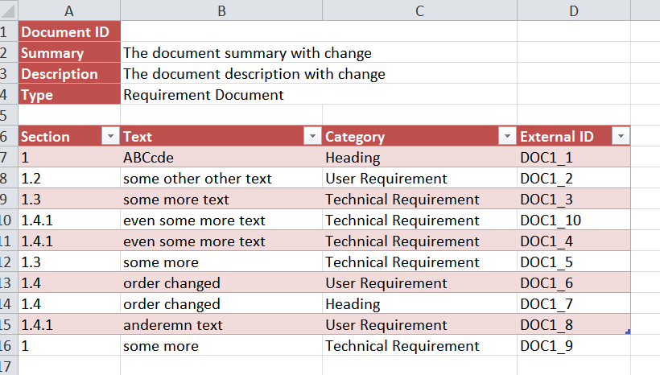

# IntegrityCustomImport
Integrity Gateway extension to create complete Integrity Lifecycle Manager Documents from Excel files. This tool provides a Java loader for Excel, directly linked into the Integrity Gateway. 

## Use Cases
- Date migration from other Requirement tools via Excel into Integrity LM

## Possible Import Layout


## Important
- Please try it out in a test environment first, NEVER go directly with this into production 
- This is NOT intended for a permanent use of Excel together with Integrity
- Use the Standard Excel Integration instead (Integrity Add On, available from the PTC Software Download Page) 

## Tested with
- Integrity LM 10.6
- Integrity LM 10.8
- Integrity LM 10.9
- Integrity LM 11.0

## Hints
- It's possible to set the Document ID, then the loader will update an existing document in Integrity
- But: be very careful, because the tool was not intended to offer this feature (even if it works like that)!
- The column "External ID" is required. This is a reference column, allowing the loader to connect Excel Data rows with Integrity Data rows. Internally the "External ID" can be mapped to a different field if needed.
- The column "Section" is required and has to have a value. The loader determines by counting the dots in the section field into which level the row has to be placed. It doesn't matter if the section number has any meaning (no need for gapless etc.)
- If you want to gain from automated formatting of the headings, then the Category column must be placed before the Text column (this feature is under review)
- If you upload into rich text fields, like into the Text, then declare this field accordingly in the mapping file. Otherwise the text may display html tags.

## Installation
- Jar files must be installed locally, because the Integrity Gateway is a local application. This can be inside your Integrity client directory, but also outside if you don't have needed write access
- Addition to the Gateway.lax is on client, pointing to the new libs above. This operation requires write access to your Integrity client directory. Gateway.lax is located in your Integrity client folder /bin.
- XML mapping files can be copied on client or server
- Addition to the gateway-tool-config.xml is on client or server
- I am using the POI libraries for Excel handling. You can also use newer versions for sure.

File List:
```
bin/gateway.lax (addition only)
config/gateway/gateway-tool-configuration.xml  (addition only, can be placed on server)
config/gateway/mappings/Excel_Import_Requirement_Document.xml (new, can be placed on server)
config/gateway/mappings/Excel_Import_Test_Suite.xml (new, can be placed on server)
lib/IntegrityCustomImport.jar (new)
lib/IntegrityAPI.jar (new)
lib/poi-3.11-20141221.jar (new)
lib/poi-ooxml-3.11-20141221.jar (new)
lib/poi-ooxml-schemas-3.11-20141221.jar (new)
lib/mksapi.jar (!! use the existing in your installation !!)
```

## Documentation
- For detailed instructions, please review the provided documentation "doc/Technical_Documentation_Migrate_Documents_with_Excel.docx"

## Related Solutions
- IntegrityCustomGateway - for easier Gateway handling: https://github.com/VEckardt/IntegrityCustomGateway
- IntegrityExcelTestSession - for Offline Test Sessions (local version): https://github.com/VEckardt/IntegrityExcelTestSession
- Integrity Test Session - for Offline Test Sessions (web version): https://github.com/VEckardt/IntegrityTestSession
- IntegrityFormatHeaders - for easy formatting of Headings: https://github.com/VEckardt/IntegrityFormatHeaders
