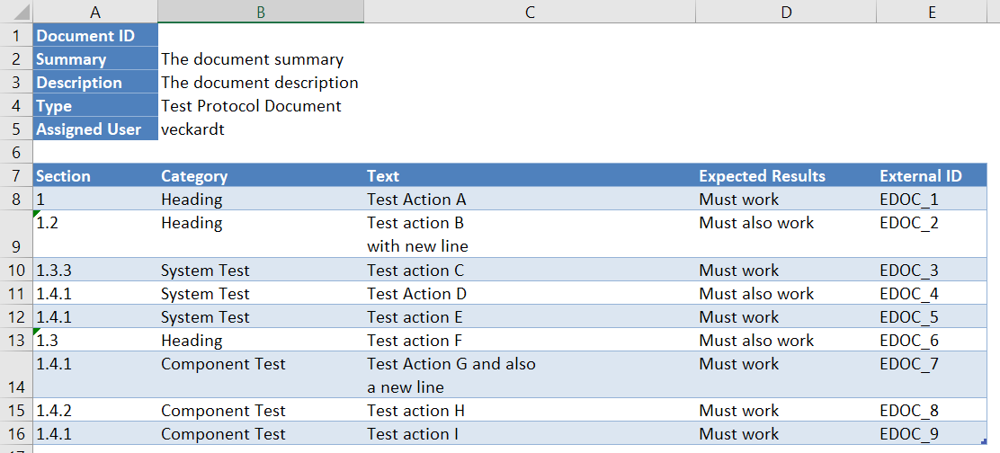

# IntegrityCustomImport
Integrity Gateway extension to create complete Integrity Documents from Excel files

## Use Cases
- Date migration from other Requirement tools via Excel into Integrity LM

## Possible Import Layout

## Installation
must be installed locally, because the Integrity Gateway is a local application

## Important
- Please try it out in a test environment first, NEVER go directly with this into production 
- This is NOT intended for a permanent use of Excel together with Integrity
- Use the Standard Excel Integration instead (Integrity Add On, available from the Software Download Page) 

## Documentation
see doc/Technical_Documentation_Migrate_Documents_with_Excel.docx
